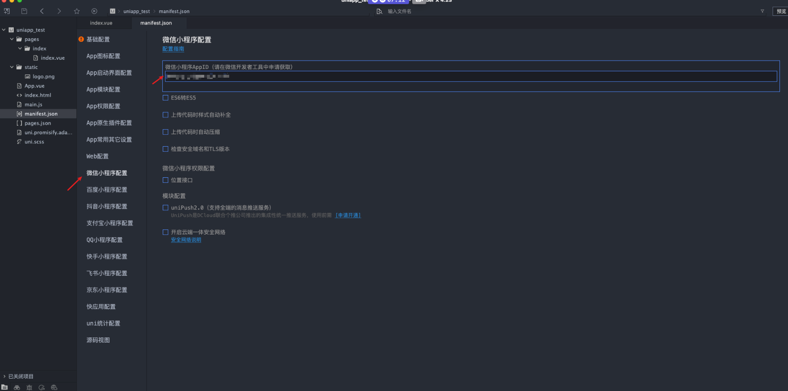

# uni-app 微信小程序开发

注册小程序账号：[https://mp.weixin.qq.com/](https://mp.weixin.qq.com/)

微信小程序下载：[https://developers.weixin.qq.com/miniprogram/dev/devtools/download.html](https://developers.weixin.qq.com/miniprogram/dev/devtools/download.html)

uniapp 官网: [https://uniapp.dcloud.net.cn/component/](https://uniapp.dcloud.net.cn/component/)

HbuilderX：[https://hx.dcloud.net.cn/Tutorial/install/windows](https://hx.dcloud.net.cn/Tutorial/install/windows)

色彩网站：[http://xh.5156edu.com/page/z1015m9220j18754.html](http://xh.5156edu.com/page/z1015m9220j18754.html)

图标网站：[https://www.iconfont.cn/](https://www.iconfont.cn/)

免费图床：[https://postimages.org/](https://postimages.org/)

## 开发环境配置

### 下载工具

HbuilderX：[https://hx.dcloud.net.cn/Tutorial/install/windows](https://hx.dcloud.net.cn/Tutorial/install/windows)

微信开发者工具：[https://developers.weixin.qq.com/miniprogram/dev/devtools/download.html](https://developers.weixin.qq.com/miniprogram/dev/devtools/download.html)

### 创建项目-配置 AppID

创建项目，vue2

获取小程序 AppID：[https://mp.weixin.qq.com/](https://mp.weixin.qq.com/)

项目配置 AppID

微信开发者工具设置

### 开发过程

uniapp 组件下载

开发展示

